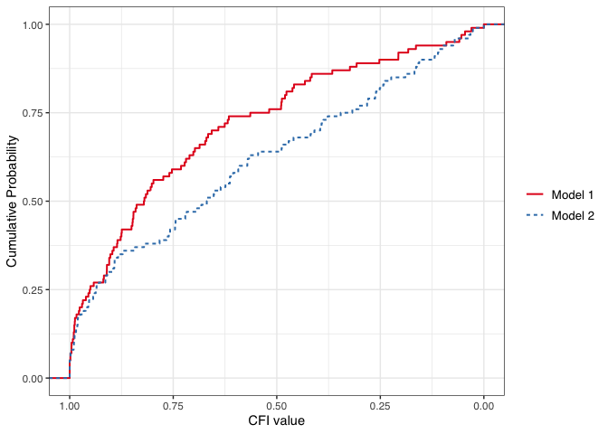
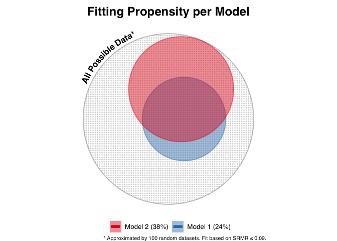
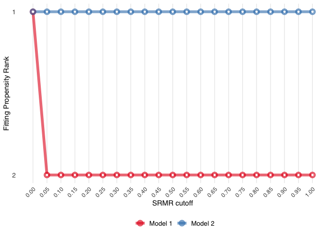
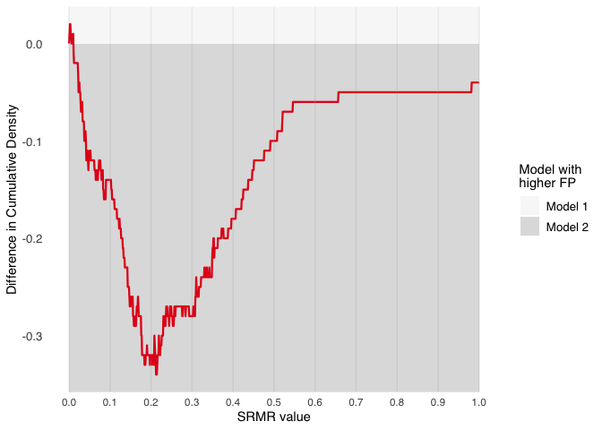

<!-- README.md is generated from README.Rmd. Please edit that file -->

# ockhamSEM

## Overview

ockhamSEM is an R package for studying the fit propensity of
single-group structural equation models with continuous items.
Underlying support is through the [lavaan](https://lavaan.ugent.be/)
package. A variety built-in graphical and text summaries are provided.

The package is introduced in Falk and Muthukrishna (2020) Parsimony in
Model Selection: Tools for Assessing Fit Propensity.

This version of ockhamSEM includes alternative graph and table outputs.

## Installation

``` r
# From GitHub:
# install.packages("devtools")
devtools::install_github("winterstat/ockhamSEM")
```

## Usage

Let’s compare fit propensity for the following two models consisting of
3 variables:


### 1. Set up a covariance matrix to fit models to:

``` r
library(ockhamSEM)

p<-3 # number of variables
temp_mat <- diag(p) # identity matrix
colnames(temp_mat) <- rownames(temp_mat) <- paste0("V", seq(1, p))
```

### 2. Define and fit the two models to be compared using the lavaan package:

``` r
mod1a <- 'V3 ~ V1 + V2
  V1 ~~ 0*V2'
mod2a <- 'V3 ~ V1
  V2 ~ V3'

mod1a.fit <- sem(mod1a, sample.cov=temp_mat, sample.nobs=500)
mod2a.fit <- sem(mod2a, sample.cov=temp_mat, sample.nobs=500)
```

### 3. Run fit propensity analysis

Here we use the onion method to generate random correlation matrices and
will compare fit propensity for the SRMR and CFI fit measures.

``` r
res <- run.fitprop(mod1a.fit, mod2a.fit, fit.measure=c("srmr","cfi"),
  rmethod="onion",reps=100)
#> [1] "Generate matrices"
#> [1] "Fitting models"
```

### 4. Summarize and plot fit propensity

#### Summarize:

``` r
summary(res)
#> 
#>  Quantiles for each model and fit measure:
#> 
#>  Model  1 
#>       srmr   cfi
#> 0%   0.001 0.000
#> 10%  0.043 0.248
#> 20%  0.072 0.479
#> 30%  0.150 0.652
#> 40%  0.208 0.728
#> 50%  0.230 0.820
#> 60%  0.278 0.876
#> 70%  0.324 0.910
#> 80%  0.375 0.971
#> 90%  0.492 0.993
#> 100% 5.945 1.000
#> 
#>  Model  2 
#>       srmr   cfi
#> 0%   0.003 0.000
#> 10%  0.025 0.152
#> 20%  0.041 0.262
#> 30%  0.066 0.405
#> 40%  0.108 0.582
#> 50%  0.131 0.669
#> 60%  0.160 0.763
#> 70%  0.198 0.899
#> 80%  0.234 0.956
#> 90%  0.294 0.989
#> 100% 0.377 1.000
#> 
#>  Information about replications for each model and fit measure:
#> 
#>  Model  1 
#> 
#> Mean across replications
#>  srmr   cfi 
#> 0.334 0.720 
#> 
#> Median across replications
#> srmr  cfi 
#> 0.23 0.82 
#> 
#> Number of finite values
#> srmr  cfi 
#>  100  100 
#> 
#> Number of NA values
#> srmr  cfi 
#>    0    0 
#> 
#>  Model  2 
#> 
#> Mean across replications
#>  srmr   cfi 
#> 0.143 0.622 
#> 
#> Median across replications
#>  srmr   cfi 
#> 0.131 0.669 
#> 
#> Number of finite values
#> srmr  cfi 
#>  100  100 
#> 
#> Number of NA values
#> srmr  cfi 
#>    0    0 
#> 
#>  Effect Sizes for Differences in Model Fit:
#> 
#>   srmr 
#> 
#>  Model 1 vs. Model 2 
#>    Cohen's d:           0.416 
#>    Cliff's delta:       0.382 
#>    Komolgorov Smirnov:  0.34 
#> 
#>   cfi 
#> 
#>  Model 1 vs. Model 2 
#>    Cohen's d:           0.326 
#>    Cliff's delta:       0.164 
#>    Komolgorov Smirnov:  0.19
```

#### Summarize intersections of FP:

``` r
intersect.fitprop(res, cutoff = c(.09, .95), lower.tail = c(TRUE, FALSE))
#> 
#> Intersections for SRMR
#> 
#>                   n proportion
#> None             56       0.56
#> Model 2          20       0.20
#> Model 1           6       0.06
#> Model 1, Model 2 18       0.18
#> 
#> Intersections for CFI
#> 
#>                   n proportion
#> None             63       0.63
#> Model 1          15       0.15
#> Model 2          12       0.12
#> Model 1, Model 2 10       0.10
```

#### Graph Output:

``` r
plot(res, type = "ecdf", whichfit = "cfi", lower.tail = FALSE)
```

<!-- -->

``` r
plot(res, type = "euler", whichfit = "srmr", cutoff = .09, lower.tail = TRUE)
```

<!-- -->

``` r
plot(res, type = "rank", whichfit = "srmr", cutoff = .09, lower.tail = TRUE)
```

<!-- -->

``` r
plot(res, type = "pairwise", whichmod = c(1,2), whichfit = "srmr", cutoff = .09, lower.tail = TRUE)
```

<!-- -->
